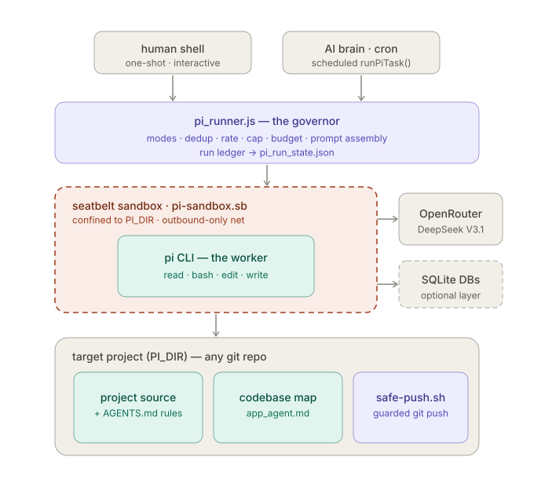
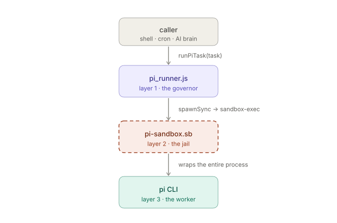
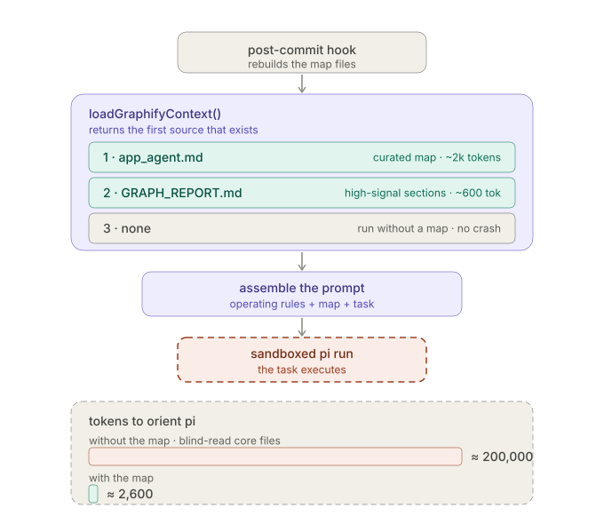
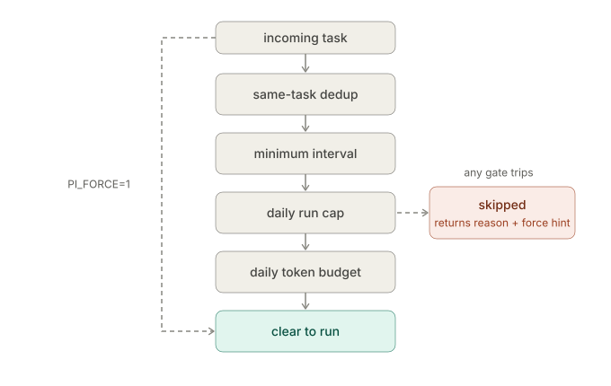
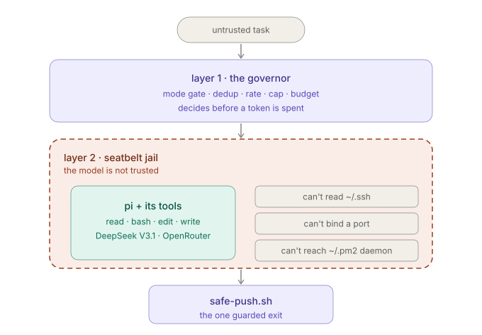

# pi-Agent Standalone — A Sandboxed AI Coding Agent You Can Trust Per Project

*A practical guide: what it is, how it works, who it's for, every control it exposes, and where to take it next.*

---

## 1. The one-paragraph version

**pi-Agent Standalone** wraps the [`pi`](https://www.npmjs.com/package/@earendil-works/pi-coding-agent) coding CLI in a hard security boundary and a set of operational governors, so an LLM can *autonomously read, edit, run, and commit code* against **any git repo** without the usual risks of an unsupervised agent: escaping the project folder, exfiltrating secrets, force-pushing, looping forever, or quietly burning your API budget. It was extracted from an automated trading platform but is **project-agnostic** — point `PI_DIR` at any repo and it confines itself to that repo, reads *its* rules (`AGENTS.md`), and injects *its* codebase map so the agent navigates instead of blind-reading 150k tokens of source.

The pitch in one line: **autonomy with a leash.** Most agent harnesses give you one or the other. This one is built around the leash.

---

## 2. How it works



*The system top-to-bottom: callers (a human shell or a scheduled AI brain) invoke the governor; the governor launches the worker inside the Seatbelt sandbox; the worker reaches the LLM (and an optional SQLite layer) and operates on the target repo — whose codebase map feeds back into the governor's prompt, and whose only write-out is the guarded git push.*

### 2.1 The three-layer bridge



*Each layer hands control to the next via a concrete mechanism: the caller's `runPiTask()` reaches the governor, which `spawnSync`s `sandbox-exec` to wrap the entire process in the Seatbelt profile, which in turn execs the `pi` worker. The detailed component view below expands each layer.*

```
┌──────────────────────────────────────────────────────────────────────┐
│  CALLER  — a human shell, a cron job, or an "AI brain" (claude_monitor)│
│           "Fix the failing test in utils"                              │
└───────────────────────────────┬──────────────────────────────────────┘
                                 │  runPiTask(task, opts)
                                 ▼
┌──────────────────────────────────────────────────────────────────────┐
│  LAYER 1 — pi_runner.js   (the GOVERNOR / bridge)                       │
│  • Mode gate:   off | readonly | full                                  │
│  • Run controls: dedup · min-interval · daily run cap · token budget   │
│  • Prompt build: autonomy preamble + codebase map + your task          │
│  • Records every run to pi_run_state.json (cost + dedup ledger)        │
└───────────────────────────────┬──────────────────────────────────────┘
                                 │  spawnSync(sandbox-exec, …)
                                 ▼
┌──────────────────────────────────────────────────────────────────────┐
│  LAYER 2 — pi-sandbox.sb   (the JAIL — macOS Seatbelt)                  │
│  deny default → narrow allows                                          │
│  • WRITE  only inside PI_DIR (+ ~/.pi runtime, temp, /dev sinks)        │
│  • READ   OS runtime + PI_DIR only — NOT ~/Documents, ~/.ssh, siblings  │
│  • NET    outbound-only (LLM API). No inbound/bind → no reverse shell   │
│  • NO ~/.pm2 reach → can't command the out-of-jail daemon (escape)     │
└───────────────────────────────┬──────────────────────────────────────┘
                                 │  exec
                                 ▼
┌──────────────────────────────────────────────────────────────────────┐
│  LAYER 3 — pi CLI   (the WORKER)                                        │
│  read · bash · edit · write tools  →  DeepSeek V3.1 over OpenRouter     │
│  Confined by Layer 2, governed by Layer 1.                             │
└──────────────────────────────────────────────────────────────────────┘
```

The key design idea: **`pi` itself has no filesystem restriction.** It will happily edit `~/.ssh/authorized_keys` if a prompt-injected instruction tells it to. So pi-Agent never trusts the model — it wraps *the entire pi process* (and every bash/edit/write tool it spawns) in a macOS Seatbelt sandbox. The model's good behavior is a bonus, not the safety mechanism.

### 2.2 The lifecycle of a single task

```
 runPiTask("regenerate the dashboard")
        │
        ├─▶ mode == "off"?  ───────────────▶ no-op, return {skipped}
        │
        ├─▶ _piGuard():  dedup? rate? daily cap? token budget?  ──▶ skip w/ reason
        │        (PI_FORCE=1 bypasses all four)
        │
        ├─▶ binary + sandbox present?  ─────▶ error if missing
        │
        ├─▶ build prompt:
        │     OPERATING RULES (never ask, iterate, verify)
        │     + CODEBASE MAP (app_agent.md ≈2k tok, w/ freshness age)
        │     + your task
        │
        ├─▶ tool policy:  readonly → ["--tools","read"]   full → all tools
        │
        ├─▶ sandbox-exec -D DIR=… -f pi-sandbox.sb  pi --model deepseek/v3.1 -p <prompt>
        │
        └─▶ record run (est tokens, hash, ts) → pi_run_state.json
             return {ok, output, estTokens, dayTokens, dayCount, graphLoaded}
```

Everything is a pure function of environment variables and on-disk state. There is no daemon, no database required, no network service. A run is one `spawnSync` with a 5-minute default timeout and a 20 MB output buffer.

### 2.3 Why a codebase map instead of blind-reading



*When `PI_LOAD_GRAPH=on`, `loadGraphifyContext()` walks a preference ladder and returns the first source that exists, then the runner prepends it to the prompt. The bars show the mechanism's payoff: a task spends ≈ 2,600 tokens to orient with the map versus ≈ 200,000 blind-reading core files — about 77× fewer. The map files are kept fresh by the post-commit hook.*

When `PI_LOAD_GRAPH=on` (the default), the runner injects a compact **codebase map** ahead of your task:

```
=== CODEBASE MAP (app_agent.md, 12m old) ===
Use this map to locate the right file/function before reading anything.
| Function       | File            | Edges |
| runPiTask()    | pi_runner.js:227| 7     |
| _piGuard()     | pi_runner.js:183| 5     |
…
=== END CODEBASE MAP ===
```

It prefers, in order: **`app_agent.md`** (≈2k tokens, curated module→file index + hub functions) → high-signal sections of **`graphify-out/GRAPH_REPORT.md`** (≈600 tokens) → nothing (no crash). The map is kept fresh automatically by a **post-commit hook** that re-runs `graphify` and regenerates `app_agent.md`, detached, so commits stay instant.

The economics are the whole point: **~2k tokens of map vs. ~150k+ tokens** of blind-reading core files just to learn where things live. The map even carries its own freshness timestamp so the agent knows whether to trust it.

---

## 3. Who it's for / where it works

| Audience | Why it fits |
|---|---|
| **Solo devs running an "AI brain"** | A long-running orchestrator (cron, PM2, a monitor loop) can call `runPiTask()` on a schedule to self-heal a codebase — exactly the trading-platform origin. |
| **Teams wanting *bounded* autonomy** | The run controls + sandbox mean you can let an agent loose on a repo overnight without it escaping, spamming the API, or pushing garbage. |
| **Security-conscious shops** | `deny default` Seatbelt, outbound-only network, secret-scanning git path. The threat model (prompt injection → exfil/escape) is addressed in the design, not bolted on. |
| **Anyone with a messy repo** | The graphify map makes the agent effective on large codebases it has never seen. |

**Platform:** macOS only today — confinement relies on `sandbox-exec` + Seatbelt (`.sb`) profiles. **Runtime:** Node ≥ 22.5 (uses the builtin `node:sqlite`, so no native build). **Model:** anything on OpenRouter that tool-calls reliably; the default is `deepseek/deepseek-chat-v3.1` (v3-0324 *narrated* actions instead of executing them — a documented gotcha).

---

## 4. Benefits at a glance

- **Autonomy with a leash** — the agent never stops to ask questions (there's no human in a headless run), yet it cannot run away with your filesystem or budget.
- **Project-agnostic** — every path is an env var derived from `PI_DIR`. One clone serves every repo on the machine.
- **Cheap orientation** — the knowledge-graph map turns a 150k-token "read everything" problem into a 2k-token lookup.
- **Cost is bounded by construction** — daily run cap *and* daily token budget *and* min-interval *and* same-task dedup, all enforced before a single token is spent.
- **Secrets can't leave** — `.env` is gitignored, the sandbox can't read `~/.ssh`, the network can't open a listener, and the only git path scans the diff for live keys.
- **Zero infra** — no server, no DB required. It's three files (`pi_runner.js`, `pi-sandboxed.sh`, `pi-sandbox.sb`) plus optional extras.

---

## 5. Use cases

| Use case | Example task |
|---|---|
| **Self-healing pipelines** | *"`portfolio_state.json` is malformed JSON. Read it, fix the corruption, write it back valid."* |
| **Bug fixes** | *"`allocation_agent.js` calculates entry prices as dollar notionals; they must be real per-share prices. Find and fix it."* |
| **Artifact regeneration** | *"The dashboard shows stale data. Regenerate it with the latest market data."* |
| **Read-only analysis** (set `readonly`) | *"Analyze the codebase for performance bottlenecks."* — no risk, no writes. |
| **Performance work** | *"`dashboard_writer.js` takes 5+ seconds to build HTML. Profile and optimize it."* |
| **Data-aware tasks** (SQL layer on) | *"Query last week's per-agent run telemetry from `meta.db` and summarize token spend."* |

The trading examples are just the origin; the same pattern applies to any repo — failing tests, lint sweeps, codemod-style refactors, doc regeneration.

---

## 6. Every control, per project

All controls are **environment variables** (typically in `.env`). Only `OPENROUTER_API_KEY` is required. This is the section to bookmark.

### 6.1 Mode gate — *what the agent is allowed to do*

`PI_BRAIN_MODE` is the master switch, evaluated fresh every run (change it with no code edit):

```
 off  ──────  runPiTask() is a no-op. The default. The brain literally cannot run pi.
 readonly ──  pi launches with  --tools read  only. Analysis/summaries; cannot mutate.
 full  ─────  all tools (read·bash·edit·write), still jailed to PI_DIR by Seatbelt.
```

> **Design note:** `off` being the default is deliberate. A fresh clone does nothing dangerous until you opt in.

### 6.2 Run controls — *how often / how much*

Enforced in `_piGuard()` *before* any token is spent. `PI_FORCE=1` (or `opts.force`) bypasses all four.



| Variable | Default | What it stops |
|---|---|---|
| `PI_DEDUP_WINDOW_MIN` | `360` (6h) | The **same task** (SHA-1 of normalized text) re-running within the window. |
| `PI_MIN_INTERVAL_MIN` | `20` | Any two runs closer than this — a global throttle. |
| `PI_MAX_RUNS_PER_DAY` | `8` | A hard daily ceiling on run count. |
| `PI_DAILY_TOKEN_BUDGET` | `250000` | Estimated tokens/day; further runs are skipped once exceeded. |

State lives in `pi_run_state.json` (a rolling ledger of the last 50 runs + today's counters). Each guard returns a human-readable `note` explaining *why* it skipped and how to override.

### 6.3 The sandbox — *where the agent can reach* (`pi-sandbox.sb`)

`(deny default)`, then surgical allows. This is the load-bearing security control:

| Capability | Policy |
|---|---|
| **Writes** | Only inside `PI_DIR`, the `~/.pi` runtime, temp, and `/dev` sinks. Nothing else. |
| **Reads** | OS runtime (`/usr`, `/System`, …) + `PI_DIR` + `~/.pi` + read-only `~/.gitconfig`. **Not** `~/Documents`, `~/.ssh`, or sibling projects. |
| **Network** | **Outbound only.** Inbound/bind denied → the agent can reach the LLM API but cannot open a listener (no reverse shell / C2 / on-host exfil server). |
| **PM2 daemon** | `~/.pm2` is **explicitly unreadable** — its RPC socket / `dump.pm2` would let the jailed agent command the out-of-jail "God" daemon to spawn *unsandboxed* processes. That's a full escape, so it's closed. |

The threat model is explicit: assume the prompt *will* be injected. The sandbox makes "do something malicious" return `EPERM` rather than relying on the model declining.

### 6.4 Codebase map — *how the agent orients*

| Variable | Default | Effect |
|---|---|---|
| `PI_LOAD_GRAPH` | `on` | Inject `app_agent.md` / graph report ahead of the task. `off` to skip. |

Per-call override: `runPiTask(task, { loadGraph: false })`. Costs ~550–2000 tokens; saves ~158k. Kept fresh by the `install-hooks.sh` post-commit pipeline.

### 6.5 Model & provider

| Variable | Default | Notes |
|---|---|---|
| `PI_PROVIDER` | `openrouter` | LLM provider. |
| `PI_MODEL` | `deepseek/deepseek-chat-v3.1` | **Must tool-call reliably.** v3-0324 narrated instead of executing. |
| `OPENROUTER_API_KEY` | — | **Required.** Read from env or `.env` (parens/comments tolerated). |

### 6.6 Path overrides — *portability*

Every runtime path is an env var so one clone is portable: `PI_DIR`, `PI_HOME_DIR`, `PI_BIN`, `PI_SANDBOX_PROFILE`, `PI_GITCONFIG`, `PI_GITCONFIG_DIR`, `PI_SANDBOX_EXEC`, `PI_ENV_FILE`. All default off `__dirname` / `$HOME`.

### 6.7 Optional SQL layer — *data-aware tasks* (off by default)

Activates only when `PI_SQL_DATA_DIR` (or a `PI_SQL_*_DB` path) is set, **and only DBs that exist on disk are granted** into the sandbox.

| Variable | Default | Purpose |
|---|---|---|
| `PI_SQL_DATA_DIR` | — | Directory holding the SQLite DBs (turns the layer on). |
| `PI_SQL_APP_STORE_DB` / `PI_SQL_MEMORY_DB` / `PI_SQL_META_DB` | derived | Explicit per-DB paths. |
| `PI_SQL_MODE` | `readwrite` | `readonly` to forbid writes/DDL. |
| `PI_SQL_MAX_ROWS` | `1000` | Result row cap. |

Two front-ends share one core (`db_core.js`, builtin `node:sqlite`): an **MCP server** (`mcp_sql_server.js`, for Claude Code / any MCP client via `.mcp.json`) and a **CLI** (`db_cli.js`, for the sandboxed pi agent, which has no MCP by design). Safety rails: `query` rejects any non-read statement; `execute` is gated by `PI_SQL_MODE`; table names are validated against an identifier allowlist before any PRAGMA; results are row-capped. The Seatbelt profile grants **exactly those DB files** (+ WAL sidecars) — never their parent dir, so the rest of the data project stays hidden.

### 6.8 The git write path — *the only way out is guarded* (`safe-push.sh`)

The agent is **never** allowed to run `git commit/push/reset/rebase` directly. The single sanctioned path enforces:

1. **Filename guard** — refuses to stage `.env`, `*.bak`, `id_rsa`, `*.pem`, `*.key`, `credentials`, `auth.json`.
2. **Content guard** — scans the staged diff for live keys (`sk-or-v1-…`, `nfp_…`, `AIza…`, `BEGIN … PRIVATE KEY`) and aborts.
3. **No history rewrite** — never `--force`, never other branches; pushes only the current branch.
4. **Hardened auth** — token fed via `GIT_ASKPASS` from `SP_GH_TOKEN` env (a fixed literal askpass script), never interpolated into argv/logs — so a poisoned token can't inject shell.
5. **Honest failure diagnosis** — distinguishes non-fast-forward from auth failure and tells you the exact fix.

`./safe-push.sh --dry-run` previews the staged set and runs every guard without writing.

### 6.9 Autonomy preamble — *behavioral control*

Prepended to every task: never ask for confirmation (no human to answer), pick a reasonable interpretation and state the assumption, don't stop at the first error — iterate and re-verify, prefer the smallest change, quote the command + output before declaring done, and stop concisely if genuinely blocked. This is what turns a chat model into a headless worker that doesn't stall.

---

## 7. How to make the app better

A prioritized roadmap, grounded in what the code does today:

**Reliability & correctness**
- **Real token accounting.** `estTokens` is `chars/4`, an estimate. Capture OpenRouter's actual usage from the response and reconcile `pi_run_state.json` against it — the budget is only as honest as its meter.
- **Structured run log.** Persist each run's task, outcome, and diff summary (not just a hash + token count) to `meta.db` so you can audit *what the agent actually changed*, not just that it ran.
- **Verify-gate before commit.** Optionally require a named verify command (`node --check`, test suite) to pass *inside the run* before `safe-push.sh` is even reachable.

**Security hardening**
- **Per-task tool allowlist** beyond `readonly`/`full` — e.g. "read + edit but no bash" for refactors that shouldn't shell out.
- **Egress allowlist.** `network-outbound` is currently all-or-nothing; pin it to the OpenRouter host(s) so a prompt-injected agent can't POST your code to an arbitrary URL.
- **Diff size / blast-radius guard.** Refuse (or flag for review) any run whose diff touches more than N files or M lines.

**Portability & reach**
- **Linux backend.** Seatbelt is macOS-only; a `bubblewrap`/`nsjail` profile with the same deny-default policy would unlock CI runners and servers.
- **Provider abstraction.** Today it's OpenRouter-shaped; a thin adapter for Anthropic/OpenAI directly would widen adoption.

**Ergonomics**
- **A `--dry-run` for `runPiTask`** that prints the assembled prompt (preamble + map + task) and the guard verdict without executing — invaluable for debugging cost and context.
- **A tiny TUI/dashboard** over `pi_run_state.json`: runs today, budget burned, last skip reason, next allowed run time.
- **Map staleness as a hard signal.** The map already carries its age; warn (or auto-rebuild) when it's older than a threshold instead of just printing it.

---

## 8. Architecture, one more time — the trust boundaries



*Color key — purple: trusted control (governor + git exit obey your config); coral: the hard boundary where the model's behavior counts for nothing; teal: the confined worker; gray: untrusted input and explicitly denied capabilities.*

Three boundaries, three different trust assumptions: the **governor** trusts the operator's config; the **sandbox** trusts *nothing the model does*; the **git path** trusts neither the diff nor the token. That layering — not the model's good manners — is what makes it safe to hand a repo to an autonomous agent and walk away.

---

*Files of record: `pi_runner.js` (governor), `pi-sandboxed.sh` (launcher), `pi-sandbox.sb` (jail), `safe-push.sh` (git path), `db_core.js`/`mcp_sql_server.js`/`db_cli.js` (optional SQL), `scripts/setup.sh` + `scripts/install-hooks.sh` (bootstrap + map pipeline). License: MIT.*
